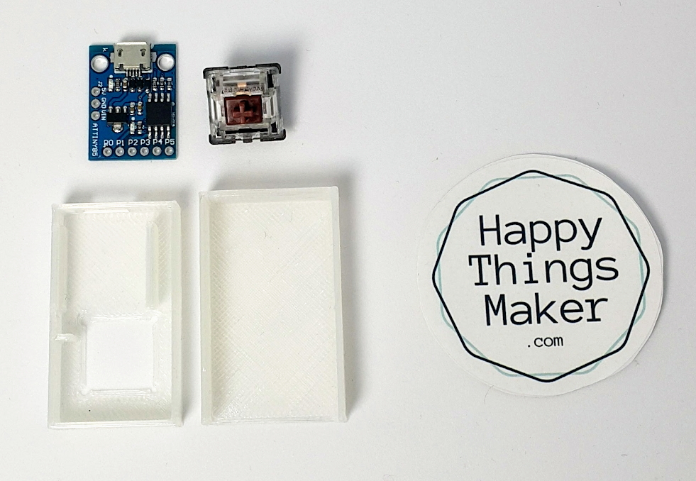
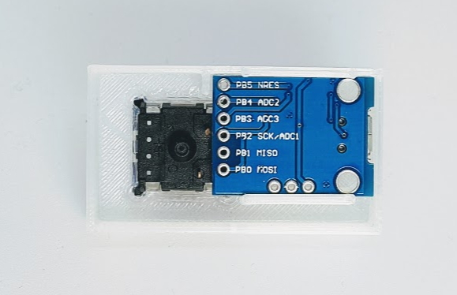
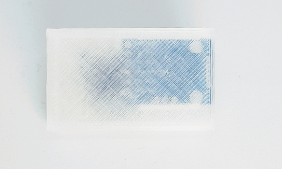
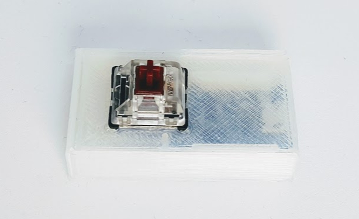
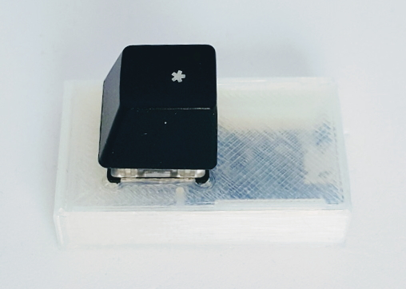
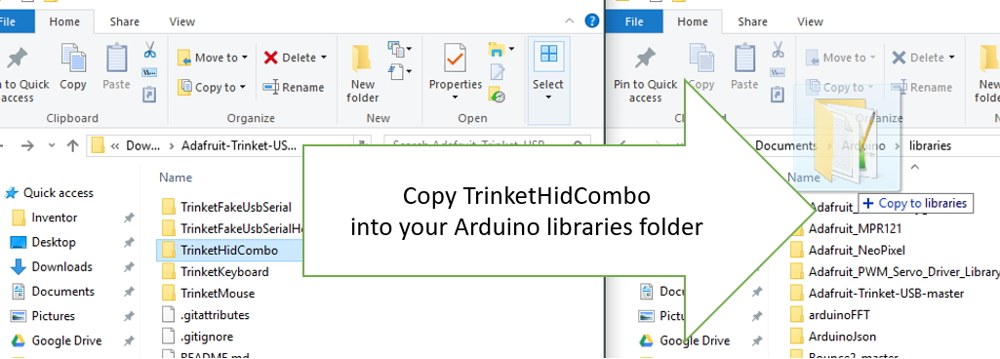
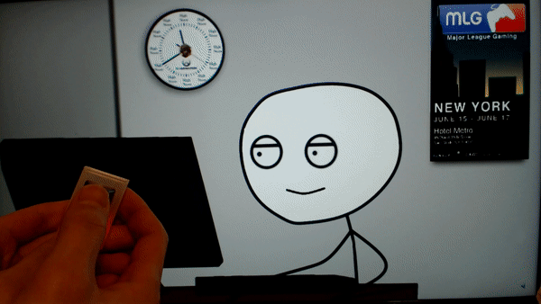

# Macro Key : HappyKeys

Youtube instruction : [Click here](https://youtu.be/Y8Oh4aj96gU)

## materials

------------------------------------ Parts ---------------------------------

- Cherry Key Switch [http://amzn.to/2BEygaX](http://amzn.to/2BEygaX)
- Attiny85 [http://amzn.to/2FvhOw6](http://amzn.to/2FvhOw6)
- Keycap [http://amzn.to/2DO1ydg](http://amzn.to/2DO1ydg)
- Micro USB cable [http://amzn.to/2Enrycm](http://amzn.to/2Enrycm)
- Finished Product(soon) [https://www.etsy.com/people/xhjkunl8?ref=hdr\_user\_menu](https://www.etsy.com/people/xhjkunl8?ref=hdr_user_menu)
- Material Kit(soon) [https://www.etsy.com/people/xhjkunl8?ref=hdr\_user\_menu](https://www.etsy.com/people/xhjkunl8?ref=hdr_user_menu)

------------------------------------ Tools ---------------------------------

- Filament for 3d print \(PLA 1.75mm\) [http://amzn.to/2DhxPpo](http://amzn.to/2DhxPpo)
- Hot melt glue gun [http://amzn.to/2CMf8cE](http://amzn.to/2CMf8cE)
- 3D printer \(P802MA\) [http://amzn.to/2CWuVZE](http://amzn.to/2CWuVZE)
- Soldering Iron Kit [http://amzn.to/2Gv8UA3](http://amzn.to/2Gv8UA3)

------------------------------------ Instruction --------------------------

- 3D model file \(for 3d printer\) [https://www.thingiverse.com/thing:2777861](https://www.thingiverse.com/thing:2777861)
- Youtube https://youtu.be/Y8Oh4aj96gU
- Manual [https://github.com/happythingsmaker/HappyKeys/blob/master/README.md](https://github.com/happythingsmaker/HappyKeys/blob/master/README.md)
- Schematic [https://github.com/happythingsmaker/HappyKeys/blob/master/README.md](https://github.com/happythingsmaker/HappyKeys/blob/master/README.md)

------------------------------------ About Maker ---------------------------------

- Instagram: [https://www.instagram.com/happythingsmaker/](https://www.instagram.com/happythingsmaker/)
- Facebook: [https://www.facebook.com/happyThingsMaker/](https://www.facebook.com/happyThingsMaker/)
- Blog : [http://happyThingsMaker.com/](http://happyThingsMaker.com/)

---

# Instruction

## Preparing Materials

### 1. 3D Printing using 3d Modeling file

* Download 3d model file from Thinggiverse
    * [https://www.thingiverse.com/thing:2777861](https://www.thingiverse.com/thing:2777861)
* Printing
    * \(Alternative: Buy from ETSY from the author\)

### 2. Buying some parts

* Finished Product [https://www.etsy.com/people/xhjkunl8?ref=hdr\_user\_menu](https://www.etsy.com/people/xhjkunl8?ref=hdr_user_menu)
* Material Kit [https://www.etsy.com/people/xhjkunl8?ref=hdr\_user\_menu](https://www.etsy.com/people/xhjkunl8?ref=hdr_user_menu)
* Cherry Key Switch [http://amzn.to/2BEygaX](http://amzn.to/2BEygaX)
* Attiny85 [http://amzn.to/2FvhOw6](http://amzn.to/2FvhOw6)
* Keycap [http://amzn.to/2DO1ydg](http://amzn.to/2DO1ydg)
* Micro USB cable [http://amzn.to/2Enrycm](http://amzn.to/2Enrycm)

### 3. Preparing some tools

* Soldering Iron Kit [http://amzn.to/2Gv8UA3](http://amzn.to/2Gv8UA3)
* Filament for 3d print \(PLA 1.75mm\) [http://amzn.to/2DhxPpo](http://amzn.to/2DhxPpo)
* Hot melt glue gun [http://amzn.to/2CMf8cE](http://amzn.to/2CMf8cE)
* 3D printer \(P802MA\) [http://amzn.to/2CWuVZE](http://amzn.to/2CWuVZE)

### 4. Assembling

1. Put a switch into upper case
    
    

2. Put an Attiny85 board in the upper case
    
    

3. Bend legs of switch toward the Attiny85 board
    
    

4. Soldering
    
    

5. Cover it
    
    

6. Use your favorite keycap

    
    
    

## Programming

1. Download and Install Arduino IDE / Board setting

    * Follow this instruction
    * [http://digistump.com/wiki/digispark/tutorials/connecting](http://digistump.com/wiki/digispark/tutorials/connecting)

2. Download a library for USB keyboard, USB mouse, USB media control simultaneously

    * [https://learn.adafruit.com/trinket-usb-volume-knob/code](https://learn.adafruit.com/trinket-usb-volume-knob/code)

    > Because the library from Digispark is not enough to use. The main issue is we can’t send a keyboard signal and a mouse signal at the same time. Sending only keyboard or mouse signal is good enough for general situation. But sometimes, we need to use both keyboard and mouse together such as gaming situation.

    

3. Unzip the file

4. Copy “TrinketHidCombo” folder into your arduino library folder
    
    

5. Open your Arduino IDE, copy and paste here's code
    
    * [https://github.com/happythingsmaker/HappyKeys](https://github.com/happythingsmaker/HappyKeys)

6. Upload the program to your board by following this order

    - Unplug the board
    - Click upload button of Arduino IDE
    - Wait until “Running Digispark Uploader … “ shows
    - Plug your board
    - Done.

    > Notice : In order to upload program to Attiny85 board, you don’t need to select any port. Unplug your board.

## Tweak it as your need

1. Facebook / Instagram auto scroller

    

    Source Code : [https://github.com/happythingsmaker/HappyKeys/tree/master/HappyKeyFacebookScroll](https://github.com/happythingsmaker/HappyKeys/tree/master/HappyKeyFacebookScroll)

2. Emergency Switch

    

    * MUTE and CLOSE a video player immediately just in case \(Emergency Exit\)

    > When I was young, I would play a game often. Every time my mother suddenly enter into my room, I had to close the game immediately, pretended to watching a “Educational Program”. Sometimes I failed. Back then, I wished I could make this switch

    [https://github.com/happythingsmaker/HappyKeys/tree/master/HappyKeyEmergencyExit](https://github.com/happythingsmaker/HappyKeys/tree/master/HappyKeyEmergencyExit)

3. Game macro example
    > My favorite game is starcraft. I am not good at macro control. For particular, manufacturing labor unit \(SCV, Prove or Drone\) or military unit such as tanks, marines. I made a macro key for this purpose. \(note: only for single play\)

    * [Produce labor unit](https://github.com/happythingsmaker/HappyKeys/blob/master/HappyKeyStarcraftLabor/HappyKeyStarcraftLabor.ino)
        
        

    * [Produce units from manufacture building](https://github.com/happythingsmaker/HappyKeys/tree/master/HappyKeyStarcraftManufacture)
        
        

    * [Typing “cheat keys”](https://github.com/happythingsmaker/HappyKeys/blob/master/HappyKeyStarcraftCheatkey/HappyKeyStarcraftCheatkey.ino)
        
        “Show me the money”, “black sheep wall”, etc …
        

4. Letter example
    * [Love letter](https://github.com/happythingsmaker/HappyKeys/blob/master/HappyKeyLoveLetter/HappyKeyLoveLetter.ino)
        
        

5. Shortcut key
    * [Arduino auto format \(Ctrl + T\)](https://github.com/happythingsmaker/HappyKeys/blob/master/HappyKeyAutoformat/HappyKeyAutoformat.ino)
    * [Save button \(Ctrl + S\)](https://github.com/happythingsmaker/HappyKeys/tree/master/HappyKeySavekey)